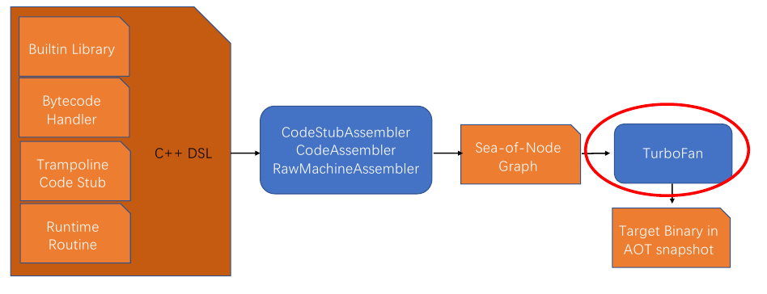
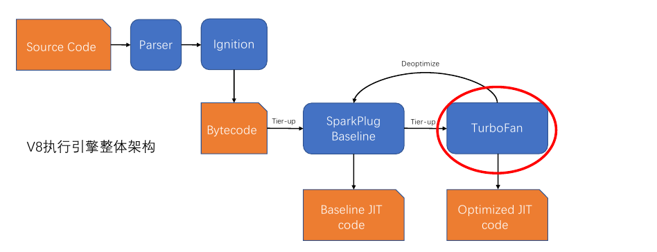
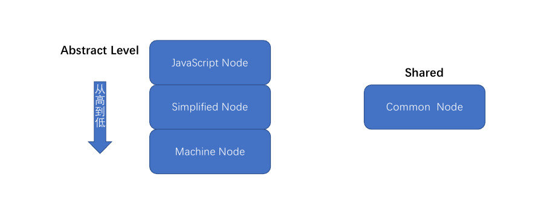
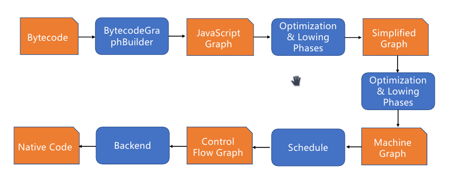
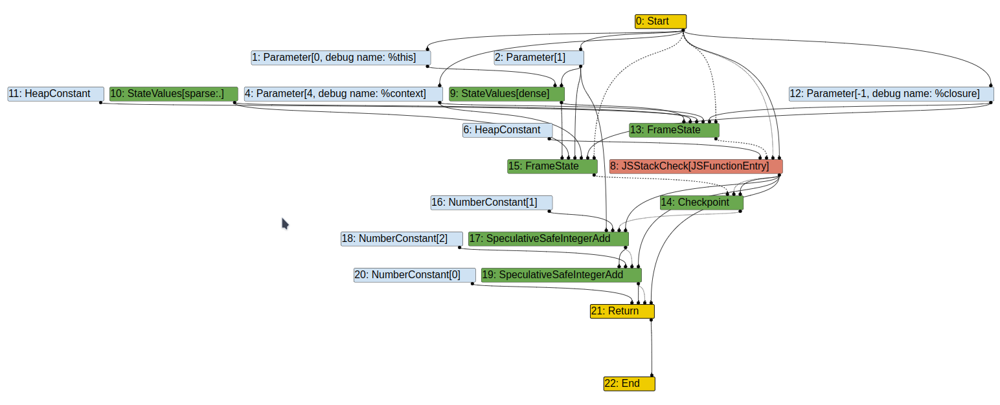

# Turbofan IR 构建原理
---
当我们出于某些需求，需要深挖 Turbofan 具体的工作细节，理解更深层次的内容时，上面的内容显然是不够的，至少是不充分的。时至今日，V8也仍在更新中，对过去的优化也并未停止。截至本篇 2023/3/17 日结稿为止，希望本文所述的内容不要过于陈旧。

## 回顾与概览 JavaScript 代码执行流程


在之前的内容里曾介绍过 V8 执行 Javascript 代码的逻辑，不过总的来说还是比较粗糙的。近日因为某些缘由，好吧，我不得不回来再好好看看了。

我们曾说 V8 既是解释器也是编译器，而 Turbofan 往往承担编译器的角色，但实际的流水线是这样的：


在 2021 年时，V8 添加了一个解释器 “Sparkplug”，并由它和 Turbofan 进行交互。

首先仍然是将代码由 Ignition 编译为字节码执行，同时，这些字节码也将被用作 Sparkplug 的输入，而它会编译字节码并执行，并且这个过程非常快，同时收集反馈，最后由 Turbofan 进行优化。但 Sparkplug 本身不对代码进行优化，他实际上起到的作用只是相当于解释执行，但这个速度要比用 Ignition 快的多。

而为什么需要多加一个编译器？我们知道，Turbofan 在遇到一些特殊情况时会主动“去优化”，这会让代码回退到 Ignition 中，而它的速度难以令人满意。那么我们在中间添加一个中介，它会将字节码编译为机器码执行，但这个编译出来的代码是没有经过优化的。尽管它编译出的代码和 Ignition 做相同的事情，但是由于它直接使用机器码执行，这仍然在性能上优于解释执行。

设计文档的原文描述：

> However, there is a big performance cliff between the two(指 Turbofan 和 Ignition); staying too long in the interpreter means we don’t take advantage of optimisation, but calling TurboFan too early might mean we “waste” time optimising functions that aren’t actually hot -- or worse, it means we deopt.

## Turbofan 的体系架构概览

说到底，还是为了抛砖引玉，本文的重点还是在 Turbofan 上。

我们一般关注的点都在它的 JIT 功能上，但 Turbofan 实际上还具有 AOT 的能力。秉承着尽可能细的原则，本文也简单介绍一下它在 AOT 方面的功能。



在编译 V8 时，一些需要被创建为快照(snapshot)的代码就可以通过 TurboFan 进行编译，最终生成一个经过优化的二进制快照。这个快照的主要功能是为了加快 V8 的启动，帮助 V8 加快启动的初始化过程，细节我们不做展开。

另一方面，我们关注的主要还是它的 JIT 能力。



这张图片概括了整个架构。TurboFan 接受 SparkPlug 传递的数据并对代码进行优化，而他主要的优化过程分为三段：

- 根据字节码生成 Sea Of Node(IR)
- 根据 IR 对代码进行优化(Lower)
- 将 IR 编译为二进制机器码

可以看出，整个 TurboFan 的流程都在围绕 IR 进行工作，而 IR 一般会被分为三个阶段：



**Common Node** 自始至终贯穿所有阶段，除此之外，在最开始的阶段只会存在 **JavaScript Node**。而在优化的过程中，会有**一部分** **JavaScript Node** 被降级为 **Simplified Node**，同理，**Simplified Node** 也会有**一部分**被降级为 **Machine Node**。

## TurboFan Pipeline

Class PipelineImpl 负责为不同的编译任务组织不同的 phase 形成不同的 Pipeline
PipelineData 是编译流水线数据载体。

在 TurboFan 中，它会将一个完整的编译任务分割交付给不同的 Phase 进行，比分说在前几篇文章中提到的 TyperPhase。而不同的 Phase 通过一个宏 DECL_PIPELINE_PHASE_CONSTANTS 进行声明：

```c++
// v8/src/compiler/pipeline.cc
struct GraphBuilderPhase {
  DECL_PIPELINE_PHASE_CONSTANTS(BytecodeGraphBuilder)//<---- 声明一个 Phase
  void Run(PipelineData* data, Zone* temp_zone) {//<---- 实现 Phase 的主要内容
    BytecodeGraphBuilderFlags flags;
    if (data->info()->analyze_environment_liveness()) {
      flags |= BytecodeGraphBuilderFlag::kAnalyzeEnvironmentLiveness;
    }
    if (data->info()->bailout_on_uninitialized()) {
      flags |= BytecodeGraphBuilderFlag::kBailoutOnUninitialized;
    }
    JSFunctionRef closure = MakeRef(data->broker(), data->info()->closure());
    CallFrequency frequency(1.0f);
    BuildGraphFromBytecode(
        data->broker(), temp_zone, closure.shared(),
        closure.raw_feedback_cell(data->dependencies()),
        data->info()->osr_offset(), data->jsgraph(), frequency,
        data->source_positions(), data->node_origins(),
        SourcePosition::kNotInlined, data->info()->code_kind(),
        flags, &data->info()->tick_counter(),
        ObserveNodeInfo{data->observe_node_manager(),
                        data->info()->node_observer()});
  }
};
```

而每个 Phase 都需要通过 PipelineImpl 类进行包装，由它来向 Phase 分配任务：

```c++
template <typename Phase, typename... Args>
auto PipelineImpl::Run(Args&&... args) {
#ifdef V8_RUNTIME_CALL_STATS
  PipelineRunScope scope(this->data_, Phase::phase_name(),
                         Phase::kRuntimeCallCounterId, Phase::kCounterMode);
#else
  PipelineRunScope scope(this->data_, Phase::phase_name());
#endif
  Phase phase;
  return phase.Run(this->data_, scope.zone(), std::forward<Args>(args)...);
}
```

这是一个模板类，它通过调用不同 Phase 实现的 Run 函数去分派编译任务。另外也可以将诸多 Phase 打包起来交给 CompilationJob 进行一整套优化的调用。

总的来说，我们关心的主要流程如下：



从安全视角来说，我们主要关心的问题都发生在第二个阶段：对 IR 进行优化。也就是上图中的 Simplified Graph 和 Machine Graph 的生成。但在本文中，笔者将主要对地一个阶段进行介绍。并且在未来的其他文章中，笔者会再起另外一篇去详细介绍优化的全过程(希望)。

## TurboFan  BytecodeGraphBuilder

本文将以如下代码作为案例：

```js
//d8 ./test.js --allow-natives-syntax --trace-turbo --print-bytecode
function add(input)
{
    let b=input + 1;
    return b+2;
}
%PrepareFunctionForOptimization(add);
add(1);
%OptimizeFunctionOnNextCall(add);
add(1);
```

根据这段代码，我们能够得到 add 函数的字节码：

```plaintext
Bytecode length: 10  
Parameter count 2  
Register count 1  
Frame size 8  
Bytecode age: 0  
  32 S> 0x10dc0025a00e @    0 : 0b 03             Ldar a0  
  38 E> 0x10dc0025a010 @    2 : 45 01 00          AddSmi [1], [0]  
        0x10dc0025a013 @    5 : c5                Star0  
  55 S> 0x10dc0025a014 @    6 : 45 02 01          AddSmi [2], [1]  
  58 S> 0x10dc0025a017 @    9 : aa                Return  
Constant pool (size = 0)  
Handler Table (size = 0)  
Source Position Table (size = 10)
```

- Parameter count 指出了这个函数的参数个数，这里包含了 **this** 指针，因此个数为 2
- AddSmi \[1\], \[0\]  中，\[1\] 指定了该指令的输入值，而第二个参数则指定了该指令所使用的反馈向量槽(slot)
> 有关 slot 的内容可以参考上一篇 chapter6 中的内联缓存

该函数生成出的十个字节码将被 BytecodeGraphBuilder 生成 SON 图：



对应的节点编号：

```
----- Graph after V8.TFBytecodeGraphBuilder ----- 
#20:NumberConstant[0]()
#0:Start()
#2:Parameter[1](#0:Start)
#16:NumberConstant[1]()
#1:Parameter[0, debug name: %this](#0:Start)
#9:StateValues[dense](#1:Parameter, #2:Parameter)
#10:StateValues[sparse:.]()
#4:Parameter[4, debug name: %context](#0:Start)
#12:Parameter[-1, debug name: %closure](#0:Start)
#15:FrameState[UNOPTIMIZED_FRAME, 2, Ignore, 0x38e100259e19 <SharedFunctionInfo add>](#9:StateValues, #10:StateValues, #2:Parameter, #4:Parameter, #12:Parameter, #0:Start)
#6:HeapConstant[0x38e100243aa9 <NativeContext[273]>]()
#11:HeapConstant[0x38e1000028c1 <Odd Oddball: optimized_out>]()
#13:FrameState[UNOPTIMIZED_FRAME, -1, Ignore, 0x38e100259e19 <SharedFunctionInfo add>](#9:StateValues, #10:StateValues, #11:HeapConstant, #4:Parameter, #12:Parameter, #0:Start)
#8:JSStackCheck[JSFunctionEntry](#6:HeapConstant, #13:FrameState, #0:Start, #0:Start)
#14:Checkpoint(#15:FrameState, #8:JSStackCheck, #8:JSStackCheck)
#17:SpeculativeSafeIntegerAdd[SignedSmall](#2:Parameter, #16:NumberConstant, #14:Checkpoint, #8:JSStackCheck)
#18:NumberConstant[2]()
#19:SpeculativeSafeIntegerAdd[SignedSmall](#17:SpeculativeSafeIntegerAdd, #18:NumberConstant, #17:SpeculativeSafeIntegerAdd, #8:JSStackCheck)
#21:Return(#20:NumberConstant, #19:SpeculativeSafeIntegerAdd, #19:SpeculativeSafeIntegerAdd, #8:JSStackCheck)
#22:End(#21:Return)
```


### Sea Of Node 构建流程

- PipelineCOmpilationJob::ExecuteJobImpl：调用 JS 函数编译 JOB
- PipelineImpl::CreateGraph()：创建 IR 的入口
- Run\<GraphBuilderPhase\>：分配编译任务给 GraphBuilderPhase 进行编译
- BuildGraphFromBytecode()：创建 BytecodeGraphBuilder 对象
- BytecodeGraphBuilder::CreateGraph：逐个建立节点
	1. 创建 Start 节点
	2. 创建并设置解释器的执行环境
	3. 创建 FeedbackCell 节点
	4. 创建 FeedbackVector 节点
	5. 检查 TierUp
	6. 创建 NaiveContext 节点
	7. 遍历 Bytecode 并创建对应的节点
	8. 创建 End 节点

> - FeedbackVector 用于保存反馈向量，而 FeedbackCell 用于保存 FeedbackVector，前提是需要 FeedbackCell 的话
> - Tier Up 指的是是否需要升级节点。一般来说，由于 TurboFan 构造的已经是低级别的 IR 了，往往不需要另外升级。但在 V8 中其实不只有 TurboFan 一个优化器，在默认的编译选项下一般不会开启其他优化器，比如说 TurboProb，它要比 TurboFan 更高级，因此它就能够通过 Tier Up 将优化过渡给 TurboFan。

### Step1-6

```c++
void BytecodeGraphBuilder::CreateGraph() {
  //...省略代码...
  int start_output_arity = StartNode::OutputArityForFormalParameterCount(
      bytecode_array().parameter_count());//<---- 获取 start 节点的输出数
  graph()->SetStart(graph()->NewNode(common()->Start(start_output_arity)));//<---- 设置 Start 节点

  Environment env(this, bytecode_array().register_count(),
                  bytecode_array().parameter_count(),
                  bytecode_array().incoming_new_target_or_generator_register(),
                  graph()->start());//<---- 创建环境
  set_environment(&env);//<---- 设置环境

  CreateFeedbackVectorNode();//<---- 创建 FeedbackVector 节点
  CreateNativeContextNode();//<---- 创建 NativeContext 节点

  VisitBytecodes();//<---- 遍历字节码
  //...省略代码...
}
```

首先通过 NewNode 创建 Start 节点并调用 SetStart 设置节点。`graph()` 将会返回一个包含了 graph 数据以及相关操作的对象。

接下来创建 `Environment` 。`Environment` 用来储存解释器的上下文状态，包括了寄存器、参数的数量、上下文等相关数据，字节码通过 `env` 来读取或修改上下文，可以理解为 “为 TurboFan 创建执行环境”：

```c++
BytecodeGraphBuilder::Environment::Environment(
    const BytecodeGraphBuilder::Environment* other)
    : builder_(other->builder_),
      register_count_(other->register_count_),//字节码对应的寄存器数量
      parameter_count_(other->parameter_count_),//参数数量
      context_(other->context_),//上下文
      control_dependency_(other->control_dependency_),//指出当前字节码的控制节点
      effect_dependency_(other->effect_dependency_),//指出当前字节码的影响节点
      values_(other->zone()),//Node 数组，用于保存上下文节点
      parameters_state_values_(other->parameters_state_values_),
      generator_state_(other->generator_state_),
      register_base_(other->register_base_),//寄存器的基索引
      accumulator_base_(other->accumulator_base_) {//累加器的索引
}
```

Environment 构造函数初始化：

```c++
  // The layout of values_ is:
  // [receiver] [parameters] [registers] [accumulator]
  //
  // parameter[0] is the receiver (this), parameters 1..N are the
  // parameters supplied to the method (arg0..argN-1). The accumulator
  // is stored separately.

  // Parameters including the receiver
  for (int i = 0; i < parameter_count; i++) {
    const char* debug_name = (i == 0) ? "%this" : nullptr;
    Node* parameter = builder->GetParameter(i, debug_name);
    values()->push_back(parameter);
  }

  // Registers
  register_base_ = static_cast<int>(values()->size());
  Node* undefined_constant = builder->jsgraph()->UndefinedConstant();
  values()->insert(values()->end(), register_count, undefined_constant);

  // Accumulator
  accumulator_base_ = static_cast<int>(values()->size());
  values()->push_back(undefined_constant);

  // Context
  int context_index = Linkage::GetJSCallContextParamIndex(parameter_count);
  context_ = builder->GetParameter(context_index, "%context");

  // Incoming new.target or generator register
  if (incoming_new_target_or_generator.is_valid()) {
    int new_target_index =
        Linkage::GetJSCallNewTargetParamIndex(parameter_count);
    Node* new_target_node =
        builder->GetParameter(new_target_index, "%new.target");

    int values_index = RegisterToValuesIndex(incoming_new_target_or_generator);
    values()->at(values_index) = new_target_node;
  }
}
```

构造函数的主要工作是初始化 `values` 成员，也就是用于保存上下文节点的 Node 数组。它的内存布局如下：

```
[receiver] [parameters] [registers] [accumulator]
```

`registers` 和 `accumulator` 部分由于环境是刚刚创建，因此初始化为 `UndefinedConstant` 类型。而如果在接下来的分析中发现需要使用这部分数据，则会将数据绑定到 `registers` 和 `accumulator` 。

> receiver 指的是函数的调用者，也就是 this 指针

通过上面这部分代码，生成了 SON 图中的 Start 节点和参数节点(#0,#1,#2,#3,#4,#5,#6)。

>#3 节点为 `UndefinedConstant` 节点，由于它没有输入和输出，因此不显示在 SON 图上
>#5 节点同理，它由 `CreateFeedbackVectorNode` 生成，指向 FeedbackVector
>#6 节点由 `CreateNativeContextNode` 生成，指向 NativeContext


### Step7-8

```c++
void BytecodeGraphBuilder::VisitBytecodes() {
  if (!bytecode_analysis().resume_jump_targets().empty()) {
    environment()->BindGeneratorState(
        jsgraph()->SmiConstant(JSGeneratorObject::kGeneratorExecuting));
  }
  if (osr_) {
    // We peel the OSR loop and any outer loop containing it except that we
    // leave the nodes corresponding to the whole outermost loop (including
    // the last copies of the loops it contains) to be generated by the normal
    // bytecode iteration below.
    AdvanceToOsrEntryAndPeelLoops();
  } else {
    BuildFunctionEntryStackCheck();
  }
  for (; !bytecode_iterator().done(); bytecode_iterator().Advance()) {
    VisitSingleBytecode();
  }
  DCHECK(exception_handlers_.empty());
}
```

遍历字节码首先会判断是否为 OSR(On Stack Replace)，然后根据情况分别进行两种情况的生成。

> 之所以需要栈上替换，可以考虑这么一种情况：
> - 在一个代码段里有一个遍历次数很多的循环，既然遍历次数很多，那么我们就需要对代码进行优化了。但它可能只是函数的一部分，函数本身并不会被执行太多次，这种时候，如果我们对整个函数都做优化就有可能存在浪费。因此我们可以考虑只对函数的某一个代码段进行优化，同时通过栈上替换的方法将这段字节码替换成优化后的 `native code`，从而让代码在执行过程中就好像是正常的解释执行似的，从而避开一些浪费。

而这里因为我们优化是对整个 add 函数进行的，因此并非 OSR，进入以下函数：

```c++
void BytecodeGraphBuilder::BuildFunctionEntryStackCheck() {
  if (!skip_first_stack_check()) {
    DCHECK(exception_handlers_.empty());
    Node* node =
        NewNode(javascript()->StackCheck(StackCheckKind::kJSFunctionEntry));
    PrepareFrameStateForFunctionEntryStackCheck(node);
  }
}
```

此处创建了一个 `StackCheck` 节点用于在函数进入时检查栈是否溢出。

> `StackCheck` 节点有一个输入是 `FrameState`，用于表示栈的状态。但是在创建节点时因为还不清楚实际的状态，因此会先将其设置成死节点(#7,#8)。

在 `PrepareFrameStateForFunctionEntryStackCheck` 中会去绑定 #7 节点对应的真正的 `FrameState` ，此处得到 #13 节点，并在过程中会生成 #9,#10,#11 节点作为其输入，分别对应了 parameter,register,accumulator。同时还有另外两个输入，一个是 Start 节点，另外一个是 #12 节点，对应了一个参数。

在外成了上面的这些节点生成，接下来是真正对字节码进行生成节点：

```c++
void BytecodeGraphBuilder::VisitSingleBytecode() {
  tick_counter_->TickAndMaybeEnterSafepoint();
  int current_offset = bytecode_iterator().current_offset();
  UpdateSourceAndBytecodePosition(current_offset);
  ExitThenEnterExceptionHandlers(current_offset);
  DCHECK_GE(exception_handlers_.empty() ? current_offset
                                        : exception_handlers_.top().end_offset_,
            current_offset);
  SwitchToMergeEnvironment(current_offset);

  if (environment() != nullptr) {
    BuildLoopHeaderEnvironment(current_offset);

    switch (bytecode_iterator().current_bytecode()) {//<---- 分发节点
#define BYTECODE_CASE(name, ...)       \
  case interpreter::Bytecode::k##name: \
    Visit##name();                     \
    break;
      BYTECODE_LIST(BYTECODE_CASE)
#undef BYTECODE_CASE
    }
  }
}
```

在 switch 中会根据字节码分派节点。

以 `Ldar` 指令为例，通过 `Visit##name()` 会展开为 `VisitLdar()` ：

```c++
void BytecodeGraphBuilder::VisitLdar() {
  Node* value =
      environment()->LookupRegister(bytecode_iterator().GetRegisterOperand(0));//<---- 在 env 的 values_ 中找到参数(a0)对应的寄存器
  environment()->BindAccumulator(value);//将 values_ 中累加器对应的节点指向(绑定) value
}
```

再以 `AddSmi` 为例，展开为 `VisitAddSmi` ：

```c++
void BytecodeGraphBuilder::VisitAddSmi() {
  FeedbackSource feedback = CreateFeedbackSource(
      bytecode_iterator().GetSlotOperand(kBinaryOperationSmiHintIndex));
  BuildBinaryOpWithImmediate(javascript()->Add(feedback));
}
```

首先获取该指令的反馈向来 `feedback` ，然后调用 `BuildBinaryOpWithImmediate` ：

```c++
void BytecodeGraphBuilder::BuildBinaryOpWithImmediate(const Operator* op) {
  DCHECK(JSOperator::IsBinaryWithFeedback(op->opcode()));
  PrepareEagerCheckpoint();
  Node* left = environment()->LookupAccumulator();//将累加器节点作为左值
  Node* right = jsgraph()->Constant(bytecode_iterator().GetImmediateOperand(0));//生成右值节点

  FeedbackSlot slot =//得到反馈向量的 slot
      bytecode_iterator().GetSlotOperand(kBinaryOperationSmiHintIndex);
  JSTypeHintLowering::LoweringResult lowering =
      TryBuildSimplifiedBinaryOp(op, left, right, slot);//尝试降低节点
  if (lowering.IsExit()) return;

  Node* node = nullptr;
  if (lowering.IsSideEffectFree()) {
    node = lowering.value();
  } else {
    DCHECK(!lowering.Changed());
    DCHECK(IrOpcode::IsFeedbackCollectingOpcode(op->opcode()));
    node = NewNode(op, left, right, feedback_vector_node());
  }
  environment()->BindAccumulator(node, Environment::kAttachFrameState);
}
```

其实到了这一步我们就不太关心具体的节点是如何生成的，生成了哪些节点了，因为用到了再查就是了。

简单来说， `PrepareEagerCheckpoint` 又创建了一个 `StateFrame` 和 `CheckPoint` ，然后在获取右值时创建了常数节点。

接下来，根据反馈向量记录的信息开始尝试能否对节点进行降级。对于不同的指令分发不同的降级方法，由于这里我们是刚刚记录下反馈信息，没有太多内容，这里只能得到 `SpeculativeSafeIntegerAdd` 节点，用于安全的整数加法。

后面的字节码以此类推即可，最后我们会在 `VisitReturn` 中创建返回节点，同时它会另外创建一个默认的返回值 0 。

以及在遍历了所有字节码后，设定 `End` 节点完成最后一步。

## 总结

本章主要分析了 TurboFan 是如何根据输入的字节码去构建 SON 图的流程。总的来说该流程分为了八步：

1. 创建 Start 节点
2. 创建并设置解释器的执行环境
3. 创建 FeedbackCell 节点
4. 创建 FeedbackVector 节点
5. 检查 TierUp
6. 创建 NaiveContext 节点
7. 遍历 Bytecode 并创建对应的节点
8. 创建 End 节点

在未来的文章中将会涉及如何对节点进行优化，希望本章的内容能够在那个时候派上用场。

## 参考

https://docs.google.com/document/d/13c-xXmFOMcpUQNqo66XWQt3u46TsBjXrHrh4c045l-A/edit
https://medium.com/@yanguly/sparkplug-v8-baseline-javascript-compiler-758a7bc96e84
https://github.com/plctlab/v8-internals/
